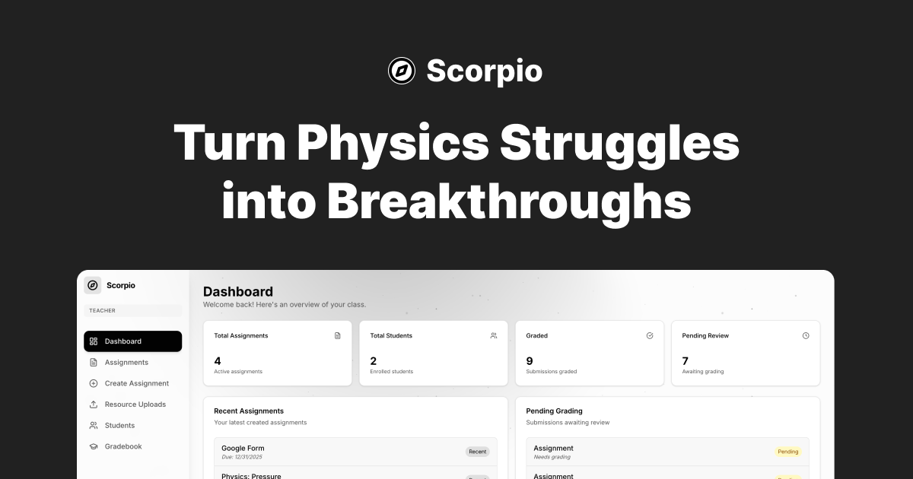

#  Scorpio

[](https://nextjs.org/)
[](https://www.typescriptlang.org/)
[](https://tailwindcss.com/)
[](https://firebase.google.com/)
[](https://deepmind.google/technologies/gemini/)



> **Transforming Physics Education through AI-Driven Socratic Tutoring.**

Scorpio is a research-driven educational platform engineered to transform physics instruction. By integrating a novel **4-layer AI constraint architecture** with a high-performance, space-themed interface, Scorpio bridges the gap between traditional Learning Management Systems (LMS) and the dynamic cognitive requirements of physics problem-solving.

---

## 🏗️ Technical Architecture

Scorpio's architecture is built for concurrency, type safety, and real-time synchronization.

### 🛡️ The 4-Layer Constraint System
At the heart of Scorpio's AI tutoring capabilities is a proprietary constraint architecture designed to ensure pedagogical validity and eliminate hallucinations.

[**📄 View Full System Architecture (PDF)**](./public/architecture.pdf)

> [!IMPORTANT]
> The system enforces strict adherence through four distinct layers:

| Layer | Constraint | Purpose |
| :--- | :--- | :--- |
| **01** | **Domain** | Restricts knowledge exclusively to physics principles. |
| **02** | **Pedagogical** | Enforces the Socratic method; direct answers are prohibited. |
| **03** | **Notation** | Mandates proper LaTeX formatting and SI unit adherence. |
| **04** | **Composite** | Synchronizes all layers for research-grade tutoring. |

### 🔄 Data & Synchronization
- **Real-Time State:** Powered by **Cloud Firestore** with optimistic UI updates for zero-latency interaction.
- **Asset Management:** Client-side processed submissions (PDFs/Images) stored via optimized base64 in **Firebase Storage**.

---

## 🚀 Core Capabilities

### 🎓 Research-Grade AI Tutoring
The Scorpio AI Tutor is a **context-aware pedagogical agent**, not a generic chatbot.
- **Context Retention:** Maintains deep awareness of specific assignments and problem states.
- **Adaptive Guidance:** Dynamically scales hint complexity based on student performance.
- **Academic Integrity:** Hardened against jailbreak attempts and direct-answer harvesting.

### 🔢 Advanced Mathematical Rendering
Precision is non-negotiable in physics. Our custom rendering engine includes:
- **KaTeX Integration:** Blazing fast client-side LaTeX rendering.
- **Visual Math Builder:** An intuitive UI for constructing complex equations without raw LaTeX knowledge.

### 🌌 Immersive User Experience
A "Space-Themed" aesthetic designed to reduce cognitive load and boost engagement.
- **Parallax Depth:** Multi-layered backgrounds powered by **Framer Motion**.
- **Glassmorphism:** Context-aware `backdrop-blur` interfaces using **Radix UI** primitives.

---

## 🔬 Research & Efficacy

Scorpio includes a dedicated research dashboard to monitor the performance of its AI architecture. System metrics track:

- **Rule Adherence %**: The frequency with which the AI successfully maintains Socratic constraints.
- **Response Quality**: Automated evaluation of pedagogical relevance and clarity.
- **Token Efficiency**: Optimization of prompt length versus output quality to reduce latency.

> [!TIP]
> **Data Insight:** *Experimental results indicate that the Full Constraint Stack significantly outperforms standard models in educational utility, maintaining a high quality score across varying difficulty levels.*

---

## 📂 Project Structure

```text
├── src/
│   ├── app/            # Next.js App Router (Student/Teacher Dashboards)
│   ├── components/     # Reusable UI (Shadcn + Custom Math Components)
│   ├── contexts/       # Global State (Auth, Space Effects)
│   ├── hooks/          # Custom React Hooks
│   ├── lib/            # Core Logic (Firebase Admin, Gemini AI, Utils)
│   └── proxy.ts        # Edge routing & middleware logic
├── public/             # Static Assets (Models, Architecture PDFs)
├── functions/          # Firebase Cloud Functions (Background Processing)
└── firestore.rules     # Database Security Layers
```

---

## 🛠️ Technology Stack

| Layer | Technology | Purpose |
| :--- | :--- | :--- |
| **Frontend** | [Next.js 15](https://nextjs.org/) | Server Components, Streaming, and Routing |
| **Language** | [TypeScript 5.7](https://www.typescriptlang.org/) | Strict type safety and developer ergonomics |
| **Styling** | [Tailwind CSS](https://tailwindcss.com/) | Utility-first styling with perceptually uniform colors |
| **UI Library** | [Shadcn UI](https://ui.shadcn.com/) | Accessible, headless component primitives |
| **Motion** | [Framer Motion](https://www.framer.com/motion/) | Physics-based animations and gesture handling |
| **Backend** | [Firebase](https://firebase.google.com/) | Auth, Firestore (NoSQL), Functions, Storage |
| **AI Model** | [Gemini 2.5 Flash](https://deepmind.google/technologies/gemini/) | Multimodal reasoning and constraint adherence |
| **Math** | [KaTeX](https://katex.org/) | Fast, accessible equation rendering |

---

## ⚡ Quick Start

### 📝 Prerequisites
- **Node.js**: 20.x or higher
- **Firebase**: A configured project with Auth, Firestore, and Storage enabled.

### 🛠️ Installation & Setup

1. **Clone & Install**
   ```bash
   git clone https://github.com/RushilMahadevu/scorpio.git
   cd scorpio
   npm install
   ```

2. **Environment Configuration**
   Create a `.env.local` file in the root:
   ```env
   # Firebase Client Config
   NEXT_PUBLIC_FIREBASE_API_KEY=your_key
   NEXT_PUBLIC_FIREBASE_AUTH_DOMAIN=your_project.firebaseapp.com
   NEXT_PUBLIC_FIREBASE_PROJECT_ID=your_project_id
   NEXT_PUBLIC_FIREBASE_STORAGE_BUCKET=your_project.appspot.com
   NEXT_PUBLIC_FIREBASE_MESSAGING_SENDER_ID=...
   NEXT_PUBLIC_FIREBASE_APP_ID=...

   # AI Configuration
   GEMINI_API_KEY=...
   ```

3. **Development Mode**
   ```bash
   npm run dev
   ```

### 🚀 Deployment
Deploy to Firebase Hosting:
```bash
npm run build
firebase deploy
```

---

© 2025 Scorpio. Built for the advancement of physics education.
