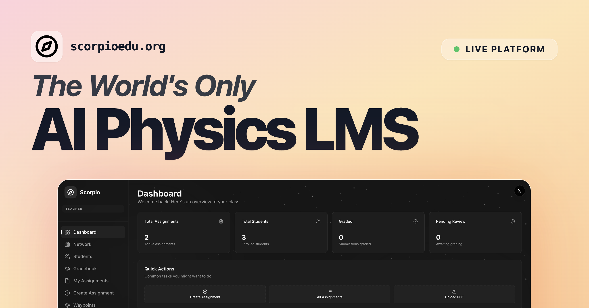
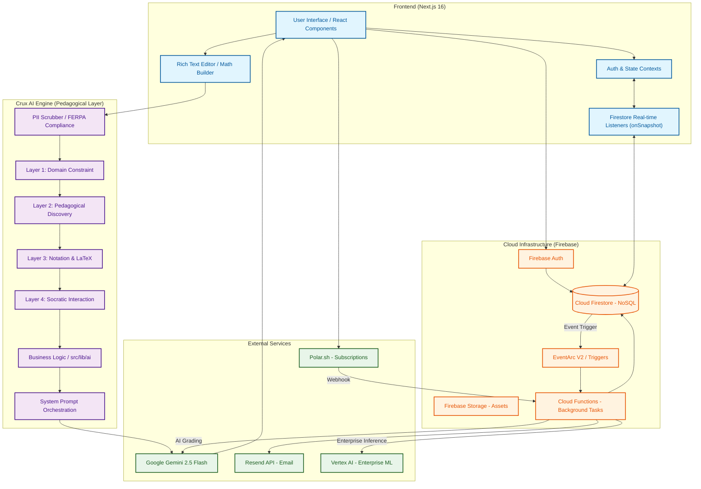
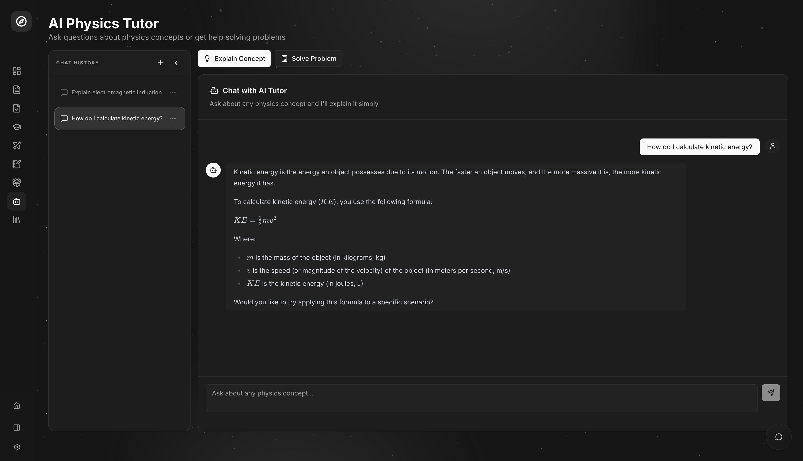
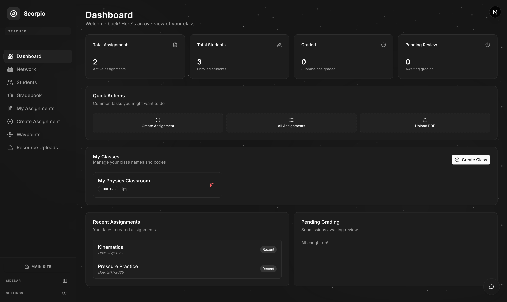
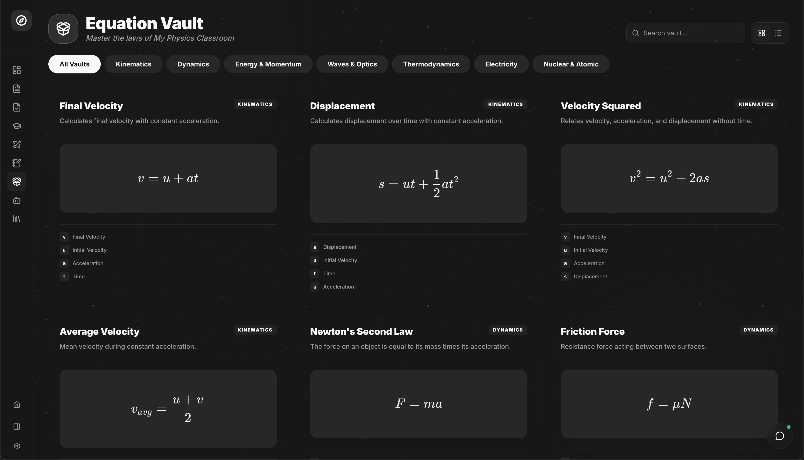

#  Scorpio

[](https://nextjs.org/)
[](https://www.typescriptlang.org/)
[](https://tailwindcss.com/)
[](https://firebase.google.com/)
[](https://deepmind.google/technologies/gemini/)
[](https://polar.sh/)



> **Transforming Physics Education through AI-Driven Socratic Tutoring.**

Scorpio is a research-driven educational platform engineered to transform physics instruction. By integrating a novel **4-layer AI constraint architecture** through its specialized pedagogical AI, **Crux**, with a high-performance, space-themed interface, Scorpio bridges the gap between traditional Learning Management Systems (LMS) and the dynamic cognitive requirements of physics problem-solving.

---

## 🏗️ Technical Architecture

Scorpio's architecture is built for concurrency, type safety, and real-time synchronization.

### 🔄 System Data Flow

```mermaid
graph TD
    classDef client fill:#e1f5fe,stroke:#01579b,stroke-width:2px,color:#01579b;
    classDef crux fill:#f3e5f5,stroke:#4a148c,stroke-width:2px,color:#4a148c;
    classDef backend fill:#fff3e0,stroke:#e65100,stroke-width:2px,color:#e65100;
    classDef external fill:#e8f5e9,stroke:#1b5e20,stroke-width:2px,color:#1b5e20;

    subgraph Client ["Frontend (Next.js 16)"]
        UI[User Interface / React Components]:::client
        Editor[Rich Text Editor / Math Builder]:::client
        Context[Auth & State Contexts]:::client
        Listen["Firestore Real-time Listeners (onSnapshot)"]:::client
    end

    subgraph Crux ["Crux AI Engine (Pedagogical Layer)"]
        Sanitize[PII Scrubber / FERPA Compliance]:::crux
        Layer1[Layer 1: Domain Constraint]:::crux
        Layer2[Layer 2: Pedagogical Discovery]:::crux
        Layer3[Layer 3: Notation & LaTeX]:::crux
        Layer4[Layer 4: Socratic Interaction]:::crux
        Logic[Business Logic / src/lib/ai]:::crux
        Compose[System Prompt Orchestration]:::crux
    end

    subgraph Backend ["Cloud Infrastructure (Firebase)"]
        Auth[Firebase Auth]:::backend
        Firestore[(Cloud Firestore - NoSQL)]:::backend
        Storage[Firebase Storage - Assets]:::backend
        Functions[Cloud Functions - Background Tasks]:::backend
        Event["EventArc V2 / Triggers"]:::backend
    end

    subgraph External ["External Services"]
        Gemini[Google Gemini 2.5 Flash]:::external
        Polar[Polar.sh - Subscriptions]:::external
        Resend[Resend API - Email]:::external
        Vertex[Vertex AI - Enterprise ML]:::external
    end

    %% Interactions
    UI --> Editor
    Editor --> Sanitize
    Sanitize --> Layer1
    Layer1 --> Layer2
    Layer2 --> Layer3
    Layer3 --> Layer4
    Layer4 --> Logic
    Logic --> Compose
    Compose --> Gemini
    Gemini --> UI

    UI --> Auth
    Auth --> Firestore
    UI --> Context
    Context <--> Listen
    Listen <--> Firestore

    Firestore -- "Event Trigger" --> Event
    Event --> Functions
    Functions --> Resend
    Functions -- "AI Grading" --> Gemini
    Functions -- "Enterprise Inference" --> Vertex
    
    UI --> Polar
    Polar -- "Webhook" --> Functions
    Functions --> Firestore
```

### 🛡️ The 4-Layer Constraint System
At the heart of Crux's AI tutoring capabilities is a **transparent and research-driven** constraint architecture designed to ensure pedagogical validity and eliminate hallucinations while maintaining full academic integrity.

[**📄 View Full System Architecture (PDF)**](./public/architecture.pdf)

> [!IMPORTANT]
> The system enforces strict pedagogical adherence through four distinct, open-source layers:

| Layer  | Constraint      | Purpose                                                      |
| :----- | :-------------- | :----------------------------------------------------------- |
| **01** | **Domain**      | Restricts knowledge exclusively to physics principles.       |
| **02** | **Pedagogical** | Enforces the Socratic method; direct answers are prohibited. |
| **03** | **Notation**    | Mandates proper LaTeX formatting and SI unit adherence.      |
| **04** | **Composite**   | Synchronizes all layers for research-grade tutoring.         |

#### Prompt Layering
[**📦 View Prompt Layering Diagram (PDF)**](./public/layering.pdf) |
[**📦 View Prompt Layering Diagram (MD)**](LAYERING.md)

### 🔄 Data & AI Infrastructure
- **Modular AI Core:** Specialized `src/lib/ai/` engines for **Tutor**, **Grading**, **Notebook**, **Practice**, **Research**, and **Network** (Student Portfolios).
- **Real-Time Synchronization:** Powered by **Cloud Firestore** with optimistic UI updates for zero-latency interaction.
- **Background Orchestration:** Firebase Cloud Functions handle automated grading, **Polar** subscriber management, and **Resend** email templates.

### 🛡️ Administrative Oversight Tools
Scorpio includes a robust management layer for educators and administrators:
- **AI Cost & Usage Analytics:** Detailed tracking of token consumption and Gemini API overhead.
- **Onboarding Management:** Teacher invite codes and registration workflow control.
- **Global Engagement Data:** Distribution charts and high-level classroom analytics.

---

## 🚀 Core Capabilities

### 🎓 Research-Grade AI Tutoring

Crux is a **context-aware pedagogical agent**, not a generic chatbot. Its reasoning logic is fully open-source and peer-reviewable.
- **Multi-Modal Assistants:** Context-specific helpers including a **Notebook Assistant**, **Landing Chatbot**, and **Navigation Assistant**.
- **Transparent Pedagogy:** Our prompt engineering and constraint layers are public to ensure academic trust.
- **Academic Integrity:** Hardened against jailbreak attempts and direct-answer harvesting.

### 📡 Teacher "Network" Control Center

A high-scale classroom management dashboard (`/teacher/network`) designed for:
- **Real-Time Monitoring:** Track student progress and aggregate analytics across multiple sections.
- **Automated Insights:** Generate student portfolios and identify learning gaps through AI-driven audit logs.

### 🔢 Advanced Mathematical Rendering

Precision is non-negotiable in physics. Our custom rendering engine includes:
- **Visual Math Builder:** An intuitive UI (powered by `mathlive`) for constructing complex equations without raw LaTeX knowledge.
- **KaTeX Integration:** Blazing fast client-side LaTeX rendering for all physics expressions.

### 🌌 Immersive User Experience
A "Space-Themed" aesthetic designed to reduce cognitive load and boost engagement.
- **Physics-Based Motion:** Smooth transitions and parallax effects powered by `framer-motion` and `lenis`.
- **Glassmorphism:** Context-aware `backdrop-blur` interfaces using **Radix UI** primitives and **Tailwind CSS v4**.

---

## 🔬 Research & Efficacy

Scorpio includes a dedicated research dashboard to monitor the performance of its AI architecture. System metrics track:

- **Rule Adherence %**: The frequency with which the AI successfully maintains Socratic constraints.
- **Response Quality**: Automated evaluation of pedagogical relevance and clarity.
- **Token Efficiency**: Optimization of prompt length versus output quality to reduce latency.

> [!TIP]
> **Data Insight:** *Experimental results indicate that the Full Constraint Stack significantly outperforms standard models in educational utility, maintaining a high quality score across varying difficulty levels.*

---

## 📂 Project Structure

```text
├── src/
│   ├── app/            # Next.js App Router (Student, Teacher, & Network Dashboards)
│   ├── components/     # Reusable UI (Shadcn + Custom Math Components)
│   ├── contexts/       # Global State (Auth, Space Effects, Appearance)
│   ├── hooks/          # Custom React Hooks (Mobile, Sidebar, Window State)
│   ├── lib/            # Core Logic (AI Core, Firebase, Polar, Usage Limits)
│   └── proxy.ts        # Edge routing & middleware logic
├── scripts/            # Admin ops (Migration, Waypoint Seeding, Metadata fixes)
├── public/             # Static Assets (Models, Architecture PDFs, Demos)
├── functions/          # Firebase Cloud Functions (Grading, Emails, Portfolios)
└── firestore.rules     # Database Security Layers
```

---

## 🛠️ Technology Stack

| Layer          | Technology                                                       | Purpose                                                |
| :------------- | :--------------------------------------------------------------- | :----------------------------------------------------- |
| **Frontend**   | [Next.js 16](https://nextjs.org/)                                | Server Components, Streaming, and Routing              |
| **Language**   | [TypeScript 5.7](https://www.typescriptlang.org/)                | Strict type safety and developer ergonomics            |
| **Styling**    | [Tailwind CSS 4.0](https://tailwindcss.com/)                     | Next-gen utility styling with modern CSS features      |
| **UI Library** | [Shadcn UI](https://ui.shadcn.com/)                              | Accessible, headless component primitives              |
| **Monetization**| [Polar.sh](https://polar.sh/)                                   | Developer-first subscriptions and billing              |
| **Motion**     | [Framer Motion](https://www.framer.com/motion/)                  | Physics-based animations and gesture handling          |
| **Backend**    | [Firebase 12](https://firebase.google.com/)                      | Auth, Firestore (NoSQL), Functions, Storage            |
| **AI Model**   | [Gemini 2.5 Flash](https://deepmind.google/technologies/gemini/) | Multimodal reasoning and constraint adherence          |

---

## ⚡ Quick Start

### 📝 Prerequisites
- **Node.js**: 20.x or higher
- **Firebase**: A configured project with Auth, Firestore, and Storage enabled.

### 🛠️ Installation & Setup

1. **Clone & Install**
   ```bash
   git clone https://github.com/RushilMahadevu/scorpio.git
   cd scorpio
   npm install
   ```

2. **Environment Configuration**
   Create a `.env.local` file in the root:
   ```env
   # Firebase Client Config
   NEXT_PUBLIC_FIREBASE_API_KEY=your_key
   NEXT_PUBLIC_FIREBASE_AUTH_DOMAIN=your_project.firebaseapp.com
   NEXT_PUBLIC_FIREBASE_PROJECT_ID=your_project_id
   NEXT_PUBLIC_FIREBASE_STORAGE_BUCKET=your_project.appspot.com
   NEXT_PUBLIC_FIREBASE_MESSAGING_SENDER_ID=...
   NEXT_PUBLIC_FIREBASE_APP_ID=...

   # Firebase Admin (Required for SSR & Functions)
   FIREBASE_CLIENT_EMAIL=...
   FIREBASE_PRIVATE_KEY=...

   # AI Configuration
   GEMINI_API_KEY=...

   # Email (Resend)
   RESEND_API_KEY=...

   # Monetization
   POLAR_ACCESS_TOKEN=...
   POLAR_ENV=production # or sandbox

   # Access Control
   NEXT_PUBLIC_TEACHER_ACCESS_CODE=...
   ```

3. **Development Mode**
   ```bash
   npm run dev
   ```

### 🚀 Deployment
Deploy to Firebase Hosting & Functions:
```bash
npm run build
firebase deploy
```

---

© 2025 Scorpio. Built for the advancement of physics education.
